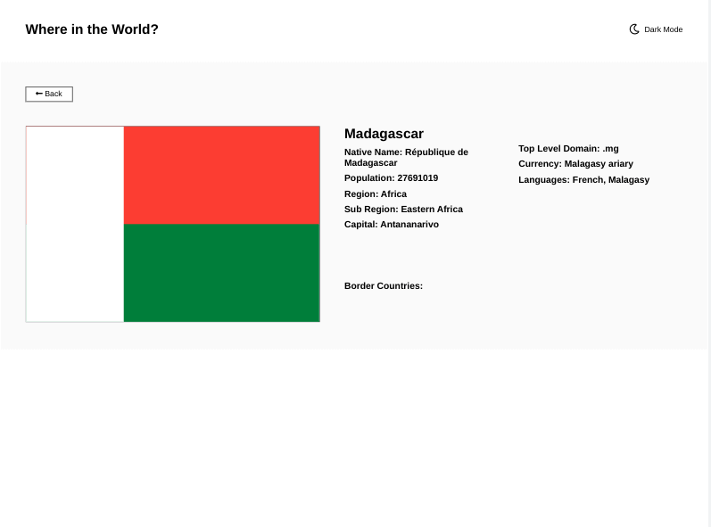

# Frontend Mentor - REST Countries API with color theme switcher solution

This is a solution to the [REST Countries API with color theme switcher challenge on Frontend Mentor](https://www.frontendmentor.io/challenges/rest-countries-api-with-color-theme-switcher-5cacc469fec04111f7b848ca). Frontend Mentor challenges help you improve your coding skills by building realistic projects. 

## Table of contents

- [Overview](#overview)
  - [The challenge](#the-challenge)
  - [Screenshot](#screenshot)
  - [Link](#link)
- [My process](#my-process)
  - [Built with](#built-with)
  - [Continued development](#continued-development)
  - [Useful resources](#useful-resources)

## Overview

### The challenge

Users should be able to:

- See all countries from the API on the homepage
- Search for a country using an `input` field
- Filter countries by region
- Click on a country to see more detailed information on a separate page
- Click through to the border countries on the detail page
- Toggle the color scheme between light and dark mode *(optional)*

### Screenshot

### Link 

## My process

### Built with

- Semantic HTML5 markup
- CSS custom properties
- Flexbox
- CSS Grid
- [React](https://reactjs.org)
- [Create React App](https://github.com/facebook/create-react-app)
- [Rest Countries API](https://restcountries.com/)

### Continued development

- Uses 2 fetches instead of caching data
- The search filter just searches for the character - not character as the first letter of the country name
- The select dropdown doesn't persist when using the search filter afterwards / reset it 
- Used matching object to get full names of border - if error - hard to find 
- Margin/Padding issues noticeable on dark mode
- Accessibility
- API changed and now requires an api key.  I deleted my gh-pages branch and removed the link.  
- The original restcountries api has been cloned and is active again.   The name, currency, and languages properties have changed.       
- NumericCode was removed - used it for key value - could add nanoid - used population and name as quick replacement
- Could look into updating packages ie React 18 
- Issue when a flag is mainly white (Pakistan) on light mode where a border would help.  Need border conditionally.  

### Useful resources

- [Dev.to](https://dev.to/zenulabidin/how-not-to-deploy-a-react-site-to-github-pages-42ge) - Github Pages and React
- [Medium](https://medium.com/@bennirus/deploying-a-create-react-app-with-routing-to-github-pages-f386b6ce84c2) - Github Pages and React
- [React](https://reactjs.org/docs/hooks-effect.html) - Hooks Effect
- [Github](https://github.com/apilayer/restcountries/issues/253) - restcountries original api renamed and requires an api key
- [Stack Overflow](https://stackoverflow.com/questions/45100477/how-to-render-a-object-in-react)
- [Stack Overflow](https://stackoverflow.com/questions/40950546/react-js-right-way-to-iterate-over-object-instead-of-object-entries)